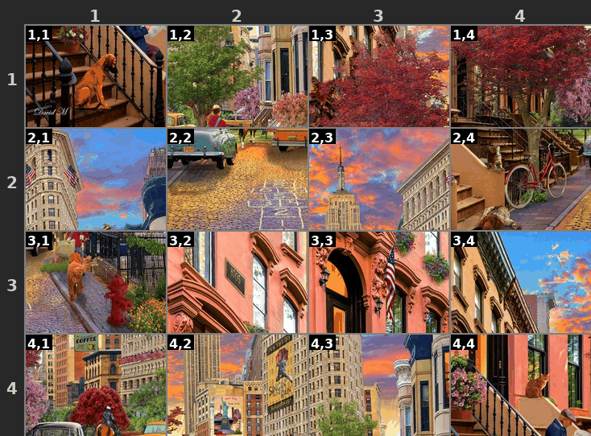

# LLM Jigsaw Puzzle Solver

A benchmark for testing multimodal LLM spatial reasoning capabilities through iterative jigsaw puzzle solving.

<p align="center">
  
  
</p>

## 🏆 Benchmark Results

**Can frontier LLMs solve jigsaw puzzles?** We tested GPT-5.2, Gemini 3 Pro, and Claude Opus 4.5 across grid sizes from 3×3 to 5×5.

<p align="center">
  
</p>

| Grid | Pieces | GPT-5.2 | Gemini 3 Pro | Claude Opus 4.5 |
|------|--------|---------|--------------|-----------------|
| 3×3  | 9      | **95%** solve, 97% acc | 85% solve, 93% acc | 20% solve, 47% acc |
| 4×4  | 16     | **40%** solve, 77% acc | 25% solve, 72% acc | — |
| 5×5  | 25     | 0% solve, 46% acc | **10%** solve, 49% acc | — |

**Key insights:**
- 🔴 **Difficulty scales steeply** — solve rates crash from 95% to 0% between 3×3 and 5×5
- 🔴 **No model reliably solves 5×5** — spatial reasoning hits a wall at 25 pieces  
- 🟡 **Partial progress is common** — models often hit a wall at 50-80% correct for 4x4 and 5x5

*GPT-5.2 and Gemini 3 Pro tested with `low` reasoning effort; Claude Opus 4.5 with `high`.*

📊 **[Detailed benchmark results →](docs/RESULTS.md)**

---

## Overview

This project shuffles an image into an N×N grid and challenges an LLM to restore the original image by iteratively swapping pieces. The task tests:

- **Visual understanding**: Recognizing piece content and how pieces fit together
- **Spatial reasoning**: Understanding grid coordinates and piece relationships
- **Iterative problem solving**: Making progress across multiple turns
- **Memory/context**: Tracking previous moves and learning from them

## Features

- **Configurable difficulty**: Square (4×4) or rectangular (3×5) grids
- **Multiple LLM providers**: OpenAI, Anthropic, Google
- **Visual annotations**: Grid labels, colored borders for easy piece identification
- **Comprehensive metrics**: Tracks moves, accuracy, tokens, timing
- **Reproducible**: Seed-based shuffling for consistent benchmarks
- **Optional hints**: Show correct count, provide reference image
- **Animated GIF output**: Visualize the solving process

## Installation

```bash
# Clone the repository
git clone https://github.com/yourusername/llm-jigsaw.git
cd llm-jigsaw

# Create virtual environment
python -m venv .venv
source .venv/bin/activate

# Install dependencies
pip install -r requirements.txt
```

## Quick Start

```bash
# Set your API key
export OPENAI_API_KEY="your-key-here"
export GOOGLE_API_KEY="your-key-here"
export ANTHROPIC_API_KEY="your-key-here"

# Run a simple puzzle
python main.py --image images/sample.jpg --resize 512 --grid-size 3 --model openai/gpt-5.2
```

📖 **[Full usage guide & CLI reference →](docs/USAGE.md)**

## How It Works

The LLM receives the shuffled puzzle image and responds with JSON specifying swaps:

```json
{
  "reasoning": "The sky piece at 1,3 belongs at 1,1 based on color continuity",
  "moves": [
    {"op": "swap", "a": "1,1", "b": "1,3"},
    {"op": "swap", "a": "2,4", "b": "4,2"}
  ]
}
```

Coordinates use 1-indexed `"row,col"` format (top-left is `"1,1"`).

## Output

Results are saved to the output directory:

```
results/run_name/
├── result.json       # Complete metrics and move history
├── initial_state.png # Shuffled puzzle at start
├── final_state.png   # Puzzle state at end
└── game.gif          # Animated solving process
```

## Project Structure

```
llm-jigsaw/
├── src/                      # Core library
│   ├── image_processor.py    # Image slicing and state management
│   ├── grid_annotator.py     # Visual annotations
│   ├── llm_interface.py      # LLM API abstraction
│   ├── game.py               # Game controller
│   └── prompts.py            # Prompt templates
├── docs/                     # Documentation
│   ├── RESULTS.md            # Benchmark results
│   └── USAGE.md              # Full usage guide
├── tests/                    # Test suite
├── images/                   # Test images
├── main.py                   # CLI entry point
└── benchmark.py              # Benchmark runner
```

## License

MIT License
