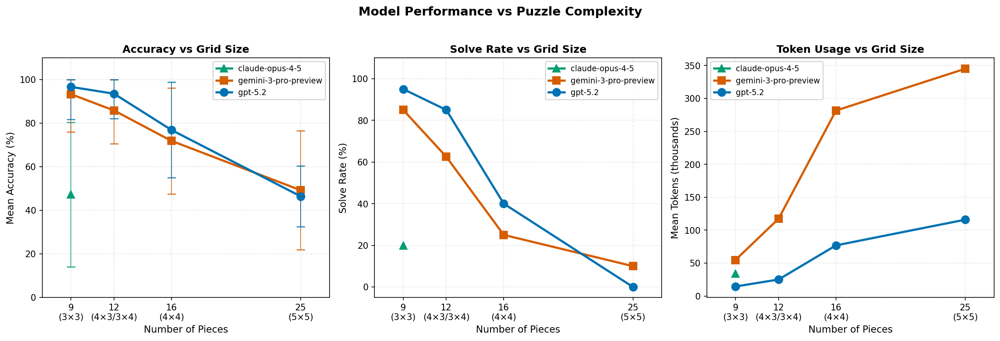

# Benchmark Results

Comprehensive benchmark results testing frontier multimodal LLMs on jigsaw puzzle solving across different grid sizes.

## Summary

| Grid Size | Pieces | GPT-5.2 Accuracy | GPT-5.2 Solve Rate | Gemini 3 Pro Accuracy | Gemini 3 Pro Solve Rate |
|-----------|--------|------------------|--------------------|-----------------------|-------------------------|
| 3×3       | 9      | 96.7%            | 95%                | 93.3%                 | 85%                     |
| 4×3/3×4   | 12     | 93.5%            | 85%                | 85.8%                 | 62.5%                   |
| 4×4       | 16     | 76.9%            | 40%                | 71.9%                 | 25%                     |
| 5×5       | 25     | 46.4%            | 0%                 | 49.2%                 | 10%                     |

*Results averaged across 20 images per model per grid size. All models received the **reference image**, **correct piece count**, and **last 3 moves** as context. Claude Opus 4.5 tested only on 3×3 (20% solve rate, 47.2% piece accuracy). Gemini-3.0 Pro and GPT-5.2 were using low reasoning effort, while Opus 4.5 was using high reasoning effort.*

## Performance vs Puzzle Complexity

<p align="center">
  
</p>

### Key Findings

1. **Steep difficulty scaling**: Solve rates drop dramatically as puzzle complexity increases
   - GPT-5.2: 95% → 0% solve rate from 3×3 to 5×5
   - Gemini 3 Pro: 85% → 10% solve rate from 3×3 to 5×5

2. **Token usage increases**: Models require significantly more tokens for larger puzzles
   - GPT-5.2: ~15K tokens (3×3) → ~116K tokens (5×5)
   - Gemini 3 Pro: ~55K tokens (3×3) → ~345K tokens (5×5)

3. **No model solves 5×5 reliably**: Even frontier models struggle with 25-piece puzzles

4. **Piece Accuracy degrades more gracefully**: Piece (partial) accuracy remains reasonable, although frontier models hit a wall between 50% and 80% for 4x4 and 5x5 puzzles

## Detailed Results by Grid Size

### 3×3 Grid (9 pieces)

| Model | Piece Accuracy | Solve Rate | Avg Turns | Avg Tokens |
|-------|----------|------------|-----------|------------|
| GPT-5.2 | 96.7% ± 14.9% | 95% | 2.9 | 14,487 |
| Gemini 3 Pro | 93.3% ± 17.4% | 85% | 3.8 | 54,770 |
| Claude Opus 4.5 | 47.2% ± 33.2% | 20% | 11.3 | 33,822 |

### 4×4 Grid (16 pieces)

| Model | Piece Accuracy | Solve Rate | Avg Turns | Avg Tokens |
|-------|----------|------------|-----------|------------|
| GPT-5.2 | 76.9% ± 21.9% | 40% | 13.6 | 76,936 |
| Gemini 3 Pro | 71.9% ± 24.3% | 25% | 14.8 | 281,648 |

### 5×5 Grid (25 pieces)

| Model | Piece Accuracy | Solve Rate | Avg Turns | Avg Tokens |
|-------|----------|------------|-----------|------------|
| GPT-5.2 | 46.4% ± 13.9% | 0% | 20.0 | 115,918 |
| Gemini 3 Pro | 49.2% ± 27.3% | 10% | 18.6 | 345,060 |

## Methodology

- **Images**: 20 diverse test images (landscapes, portraits, abstract art, photos)
- **Seed**: Fixed seed (42) for reproducible shuffling
- **Max turns**: 12 turns for 3×3, 17 turns for 4x4, 20 turns for 5x5
- **Hints enabled**: **Reference image**, **correct count**, **last 3 moves**
- **Image size**: Resized to 512px shortest side
- **Reasoning effort**: GPT-5.2 and Gemini 3 Pro used `low` reasoning effort; Claude Opus 4.5 used `high` reasoning effort. Neither can solve puzzles without reasoning even for 3x3 grid sizes. That said, using higher reasoning resulted in only slightly better results on average 5x5 grid sizes.

> **Note on reasoning effort**: Informal testing with `high` reasoning effort for GPT-5.2 and Gemini 3 Pro showed slightly better performance (up to ~10%), but at significantly higher cost (a single puzzle could consume ~1M tokens with Gemini) and much longer solving times. Requests would quite often time out for `medium` or `high` reasoning for gpt-5.2. Both GPT and Gemini would still be stuck at ~50%-70% piece accuracy on average for 5x5 grids. We opted for `low` reasoning to keep the benchmark practical.

## Reproducing Results

```bash
# Run benchmark for a specific grid size
python benchmark.py \
  --grid-size 3 \
  --models openai/gpt-5.2 google/gemini-3-pro-preview \
  --images-dir images/ \
  --seed 42 \
  --resize 512
```

See [USAGE.md](USAGE.md) for full benchmark documentation.
